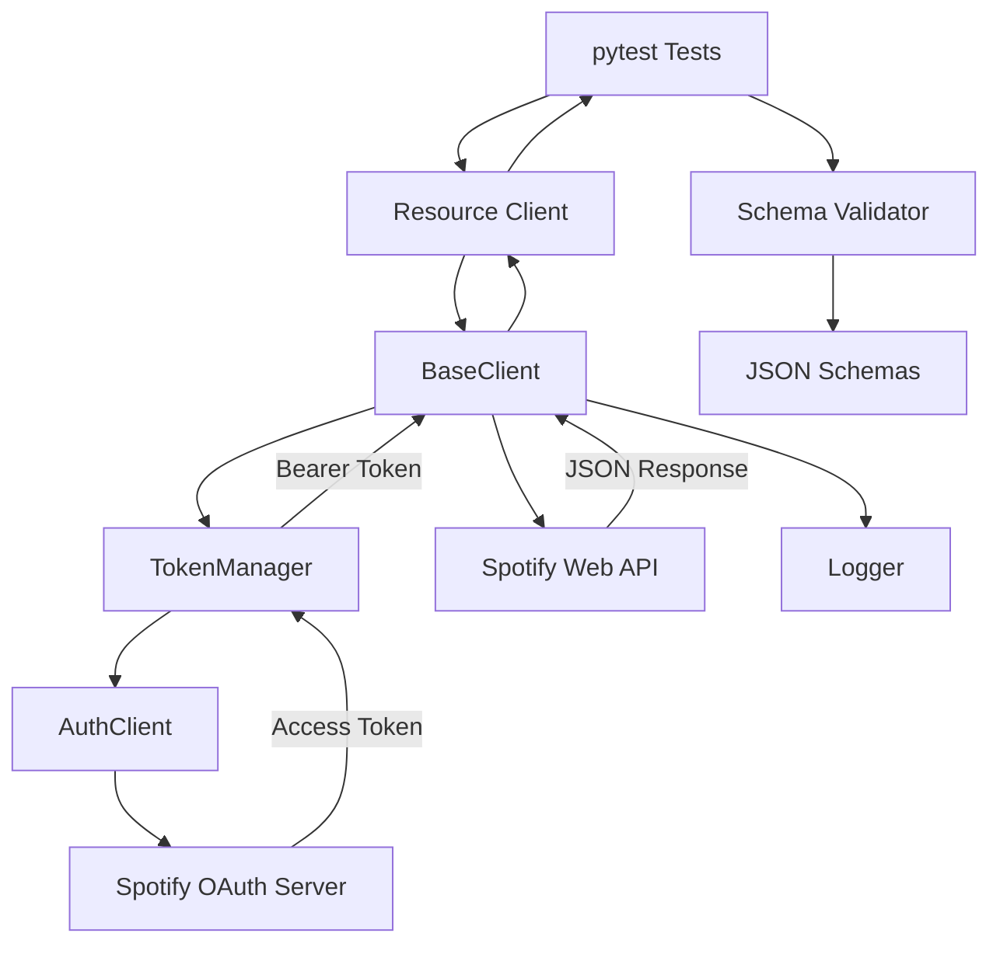
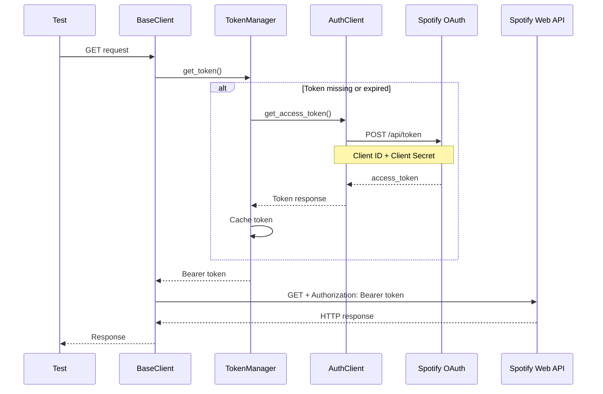
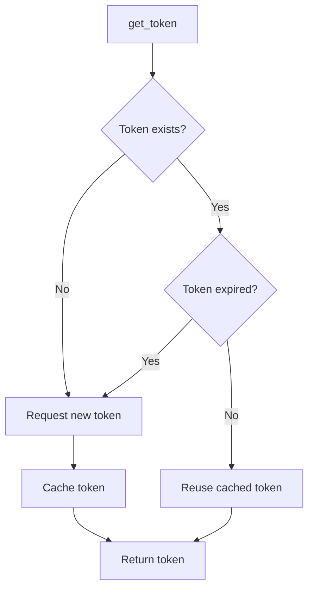
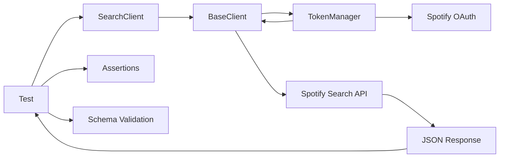
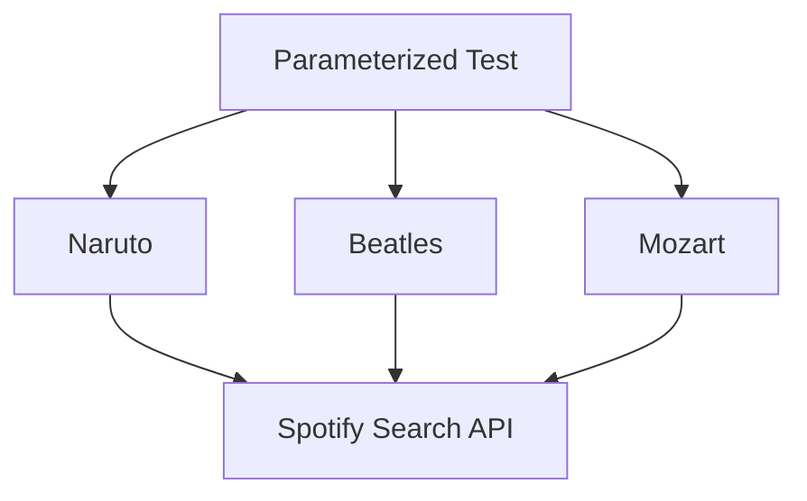
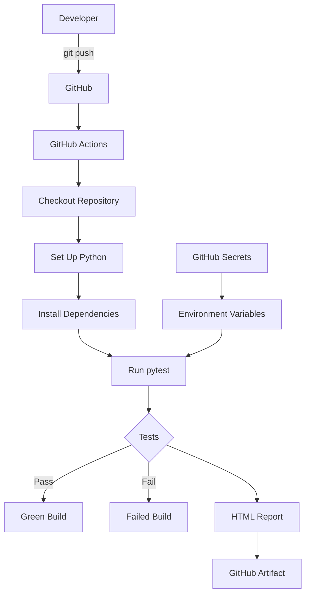

# Spotify API Testing Framework

A Python API automation framework built with **pytest** for testing the Spotify Web API.

The project demonstrates a maintainable API testing architecture with OAuth 2.0 authentication, Bearer-token management, reusable API clients, JSON Schema validation, data-driven testing, logging, HTML reporting, and GitHub Actions CI.

---

## Features

* Python + pytest
* Spotify Web API
* OAuth 2.0 Client Credentials flow
* Bearer-token authentication
* Automatic token caching and expiration handling
* Reusable API client architecture
* Positive API testing
* Negative authentication testing
* JSON Schema validation
* Parameterized/data-driven testing
* Request and response logging
* pytest markers
* HTML test reports
* GitHub Actions CI
* GitHub Secrets for credentials

---

# Architecture

The framework separates test behavior, API operations, HTTP communication, authentication, configuration, test data, and validation.



The tests focus on **what should happen**, while the framework handles **how the request is made**.

---

# Project Structure

```text
spotify-api-testing-framework/
│
├── auth/
│   ├── __init__.py
│   ├── auth_client.py
│   └── token_manager.py
│
├── clients/
│   ├── __init__.py
│   ├── base_client.py
│   └── search_client.py
│
├── config/
│   ├── __init__.py
│   └── config.py
│
├── data/
│   ├── __init__.py
│   └── search_data.py
│
├── schemas/
│   └── search_response_schema.json
│
├── tests/
│   ├── __init__.py
│   ├── conftest.py
│   ├── test_authentication.py
│   └── test_search.py
│
├── utils/
│   ├── __init__.py
│   ├── logger.py
│   └── schema_validator.py
│
├── reports/
│
├── .github/
│   └── workflows/
│       └── api-tests.yml
│
├── .env
├── .gitignore
├── pytest.ini
├── requirements.txt
└── README.md
```

---

# Component Responsibilities

| Component            | Responsibility                                |
| -------------------- | --------------------------------------------- |
| `tests/`             | Test scenarios and assertions                 |
| `clients/`           | Spotify API operations and HTTP communication |
| `auth/`              | OAuth 2.0 authentication and token management |
| `config/`            | Environment/configuration access              |
| `data/`              | Reusable and parameterized test data          |
| `schemas/`           | Expected JSON response structures             |
| `utils/`             | Logging and reusable framework utilities      |
| `reports/`           | Generated test reports                        |
| `.github/workflows/` | CI configuration                              |

---

# OAuth 2.0 Authentication

The framework uses Spotify's **OAuth 2.0 Client Credentials flow**.



The authentication request uses:

```text
grant_type=client_credentials
```

Spotify returns an OAuth access token:

```json
{
    "access_token": "...",
    "token_type": "Bearer",
    "expires_in": 3600
}
```

The framework then sends API requests using:

```http
Authorization: Bearer <access_token>
```

---

# Token Management

`TokenManager` prevents the framework from requesting a new OAuth token for every API call.



A small expiration buffer can be used so the framework renews a token shortly before it expires.

---

# Configuration

Local configuration is stored in `.env`.

Example:

```text
SPOTIFY_CLIENT_ID=your_client_id
SPOTIFY_CLIENT_SECRET=your_client_secret

SPOTIFY_AUTH_URL=https://accounts.spotify.com/api/token
SPOTIFY_BASE_URL=https://api.spotify.com/v1
```

Do **not** commit `.env`.

The `.gitignore` should contain:

```text
.env
.venv/
__pycache__/
.pytest_cache/
reports/
```

---

# Installation

Clone the repository:

```bash
git clone https://github.com/poonsgollamudi/spotify-api-tests.git
cd spotify-api-testing-framework
```

Create a virtual environment:

```bash
python -m venv .venv
```

Activate it on Windows:

```bash
.venv\Scripts\activate
```

On macOS/Linux:

```bash
source .venv/bin/activate
```

Install dependencies:

```bash
pip install -r requirements.txt
```

---

# Running Tests

Run the complete suite:

```bash
pytest -v
```

Run tests with console output:

```bash
pytest -v -s
```

---

# Test Categories

The framework uses pytest markers.

### Smoke

Critical API functionality:

```bash
pytest -m smoke -v
```

### Authentication

OAuth/Bearer-token scenarios:

```bash
pytest -m auth -v
```

### Schema

Response schema validation:

```bash
pytest -m schema -v
```

### Regression

Broader data-driven scenarios:

```bash
pytest -m regression -v
```

Markers can also be combined:

```bash
pytest -m "smoke or auth" -v
```

or:

```bash
pytest -m "regression and not auth" -v
```

---

# API Test Flow

A typical search test follows this path:



Example test:

```python
def test_search_tracks_returns_success(search_client):

    response = search_client.search_tracks(
        query="Naruto",
        limit=5
    )

    assert response.status_code == 200
```

The test does not need to know how OAuth authentication or HTTP headers are implemented.

---

# Data-Driven Testing

Test data is separated from test logic.

Example:

```python
SEARCH_QUERIES = [
    "Naruto",
    "Beatles",
    "Mozart"
]
```

The same test can run against multiple inputs:

```python
@pytest.mark.parametrize("query", SEARCH_QUERIES)
def test_search_tracks_with_different_queries(
    search_client,
    query
):
    response = search_client.search_tracks(
        query=query,
        limit=5
    )

    assert response.status_code == 200
```

Conceptually:



---

# JSON Schema Validation

Response structures are validated using JSON Schema.

```text
Spotify Response
       │
       ▼
JSON Schema Validator
       │
       ▼
Expected Schema
       │
       ▼
PASS / FAIL
```

Schema validation can verify:

* Required properties
* Data types
* Nested objects
* Arrays
* Required fields

Example:

```python
validate_schema(
    response.json(),
    "search_response_schema.json"
)
```

Schema validation complements functional assertions.

For example:

```python
assert response.status_code == 200
```

tests API behavior, while JSON Schema validation checks the response structure.

---

# Negative Authentication Testing

The framework supports intentionally sending requests with:

```text
Valid Bearer token
Invalid Bearer token
No Bearer token
```

Example:

```python
def test_request_without_token_returns_401(search_client):

    response = search_client.search_tracks(
        query="Naruto",
        use_auth=False
    )

    assert response.status_code == 401
```

Invalid token:

```python
def test_request_with_invalid_token_returns_401(search_client):

    response = search_client.search_tracks(
        query="Naruto",
        token="invalid-token"
    )

    assert response.status_code == 401
```

This allows authentication failures to be tested without changing the framework's normal authentication behavior.

---

# Logging

HTTP requests are logged by `BaseClient`.

Example:

```text
GET https://api.spotify.com/v1/search
params={'q': 'Naruto', 'type': 'track', 'limit': 5}

Response | status=200 | duration=0.231s
```

Sensitive values should never be logged.

Do not log:

```text
Authorization headers
Bearer tokens
Spotify Client Secret
.env contents
```

Non-success responses can include a limited amount of response information for debugging.

---

# HTML Reports

Generate an HTML report:

```bash
pytest -v \
    --html=reports/report.html \
    --self-contained-html
```

Windows:

```powershell
pytest -v --html=reports/report.html --self-contained-html
```

The generated report contains test results, execution times, and failure details.

---

# Continuous Integration

GitHub Actions automatically runs the API tests.



The workflow runs on pushes and pull requests to `main`.

---

# CI Secrets

Spotify credentials must not be stored in the repository.

They are configured using GitHub repository secrets:

```text
SPOTIFY_CLIENT_ID
SPOTIFY_CLIENT_SECRET
```

Locally:

```text
.env
 ↓
python-dotenv
 ↓
os.getenv()
```

In GitHub Actions:

```text
GitHub Secrets
 ↓
Environment Variables
 ↓
os.getenv()
```

The application code therefore works in both environments without needing separate authentication implementations.

---

# Framework Design

The framework follows a layered approach:

```text
Tests
  │
  ▼
Resource Clients
  │
  ▼
BaseClient
  │
  ├─────────────► Logging
  │
  ▼
TokenManager
  │
  ▼
AuthClient
  │
  ▼
OAuth 2.0
  │
  ▼
Spotify Web API
```

Each layer has a focused responsibility.

**Tests** describe expected behavior.

**Resource clients** describe API operations.

**BaseClient** handles common HTTP behavior.

**TokenManager** handles access-token lifecycle.

**AuthClient** communicates with the OAuth server.

**Config** provides environment configuration.

**Schemas** define expected response structures.

**Data** supplies reusable test inputs.

**Utilities** provide reusable framework functionality.

---

# Technologies

* Python
* pytest
* Requests
* OAuth 2.0
* Spotify Web API
* JSON Schema
* python-dotenv
* pytest-html
* Git
* GitHub
* GitHub Actions

---

# Future Improvements

Potential extensions include:

* POST, PUT, PATCH, and DELETE support
* `requests.Session()` connection reuse
* Additional Spotify resource clients
* More boundary and negative tests
* Rate-limit testing
* Better test-report metadata
* CI smoke/regression workflow separation
* Environment-specific configuration
* Mock API testing
* Pact consumer-driven contract testing

---

# Purpose

This project was created as a practical exercise in designing a maintainable API automation framework rather than simply writing individual API test scripts.

The framework demonstrates separation of concerns across authentication, HTTP communication, API operations, test data, schema validation, logging, reporting, and CI/CD.
